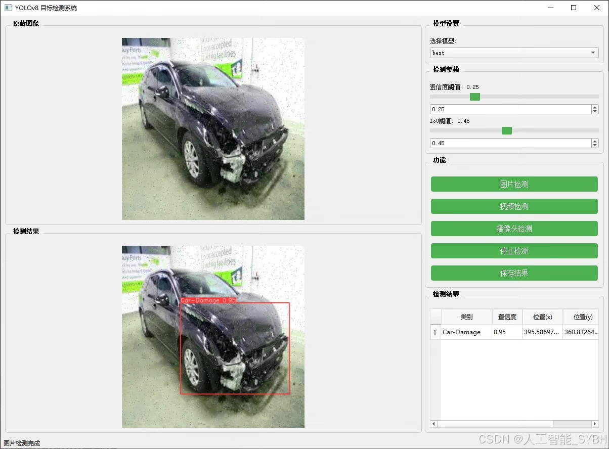
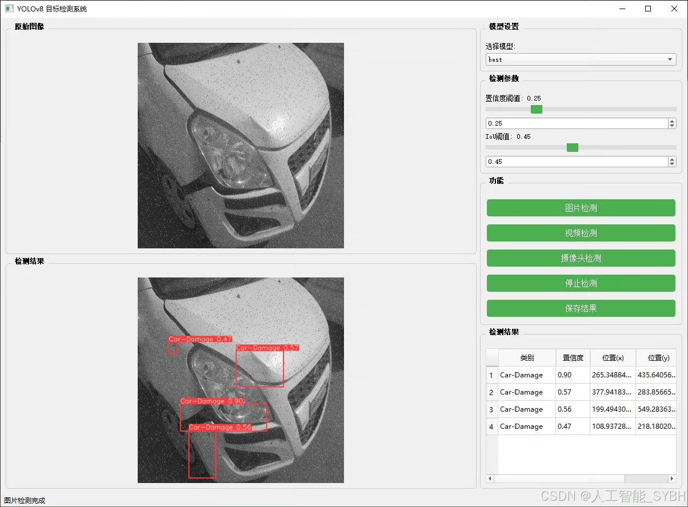
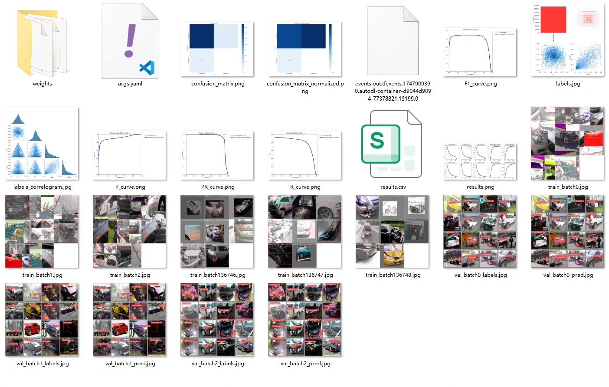
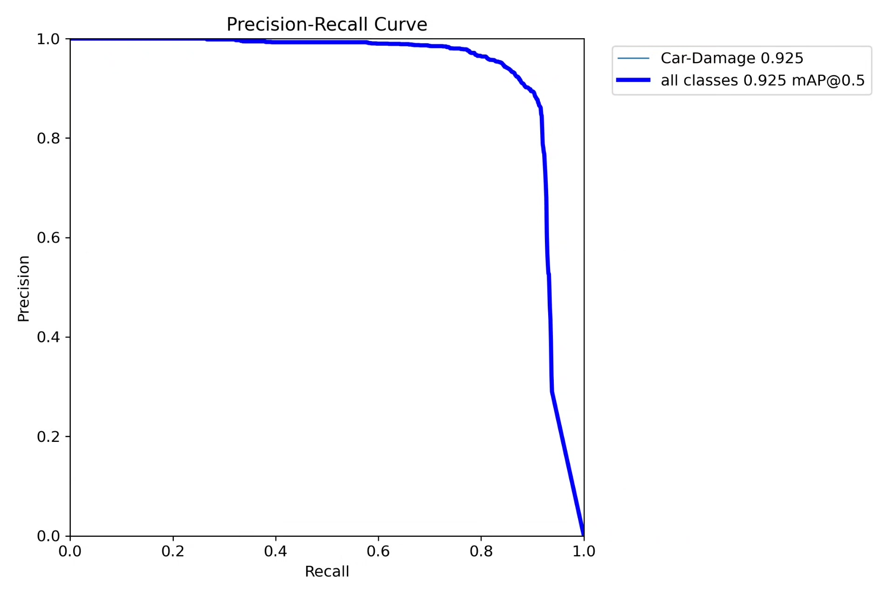
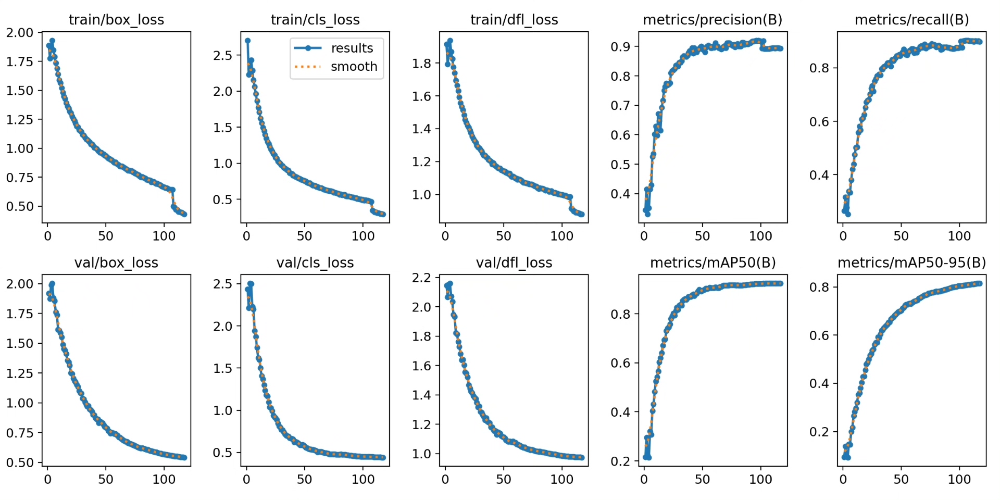
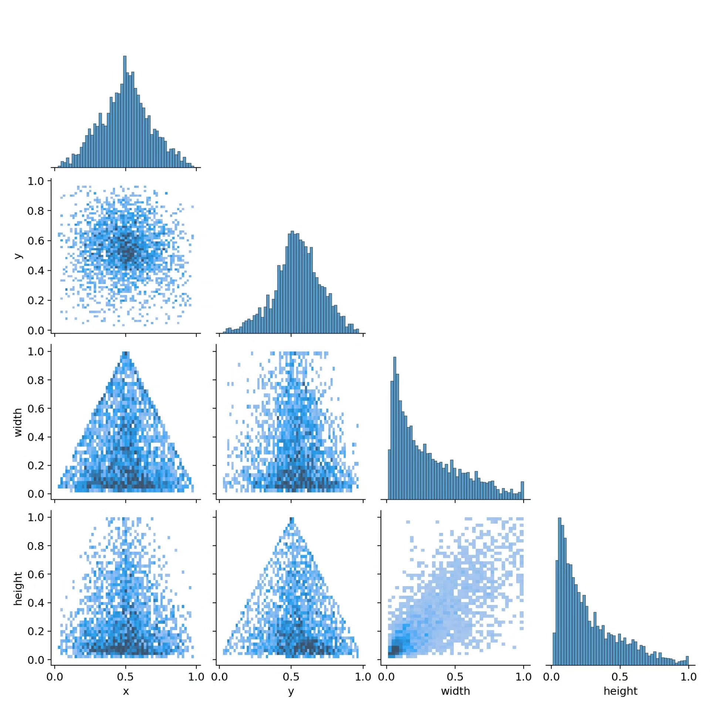
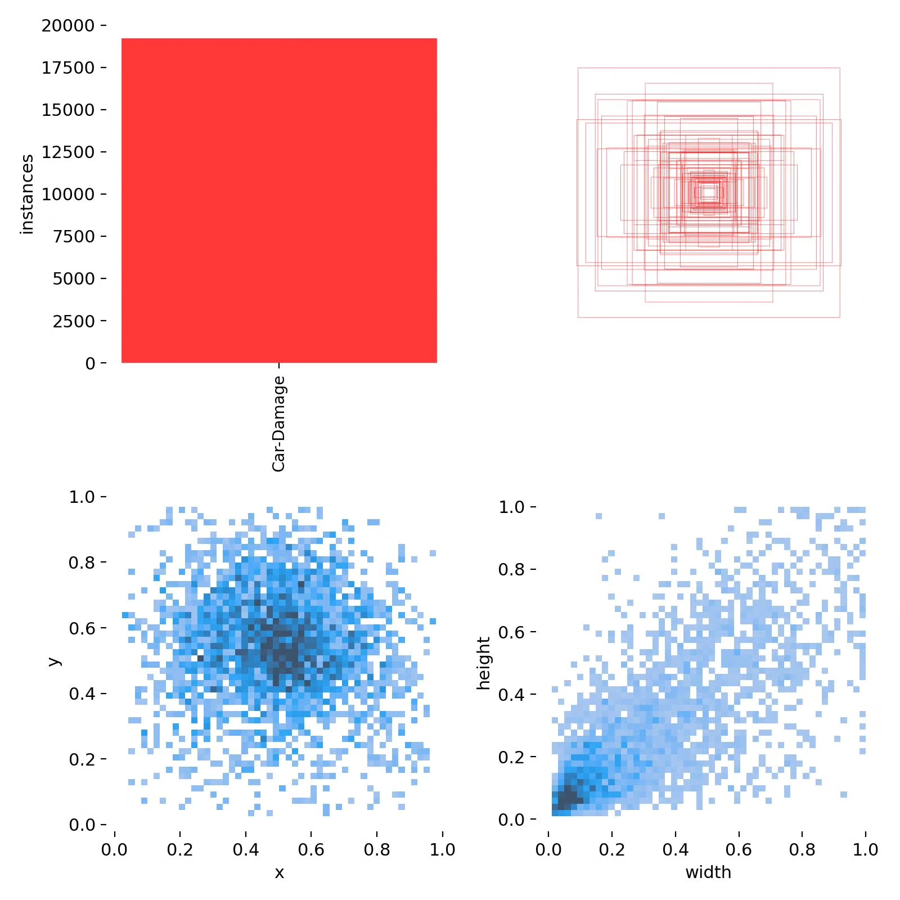
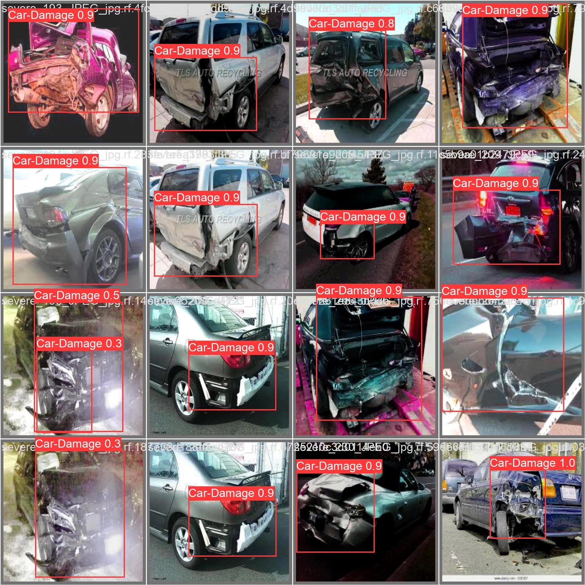

# Based on deep learning YOLOv8, a car damage recognition detection system

## Body

This project is based on the advanced YOLOv8 object detection algorithm, developing a set of intelligent detection systems specifically for automotive damage recognition. The system can accurately identify and locate various damages on the surface of vehicles through real-time analysis of exterior images, including scratches, dents, scrapes, and other common damage types. The project uses a professional dataset containing 11,675 labeled images (10,218 training images, 971 validation images, and 486 test images), which are trained using deep learning techniques to develop high-performance automotive damage detection models.

The company's products have obtained YOLO official commercial license certification.

We provide after-sales service.

After payment, we will provide WeChat IDs for instant questions and answers.

Environment configuration: We will provide an environment configuration tutorial, and WeChat will provide答疑.

Remote installation services: If you need remote configuration, an additional fee of 69 is required, with all fees refunded if the configuration fails (only the installation fee is refunded for older computers).

Retraining the dataset: After configuring the environment, you can train on your own computer. If you need us to retrain, just pay 69 plus the computing power fee (2.5 yuan/hour).

Full after-sales service

## Images

## Payment

Here is a pay link on Stripe ( https://buy.stripe.com/3cs8yP7sY87d0vu9AB ). Please contact me lonlonago@foxmail.com after funding $89, and I will send you a complete data files , thank you!

